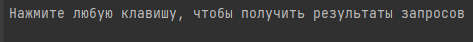

# Test Task

*Программа предназначена для вывода результатов нескольких запросов к БД*
Всё, что нужно для использования - нажать на любую клавишу после появления сообщения с просьбой, как на картинке ниже

